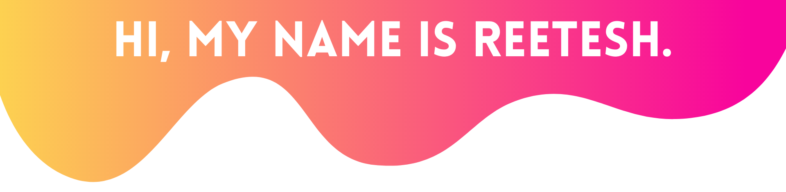

<p align="center">
  
</p>

<p align="center">
	<a href="https://linkedin.com/in/reeteshsudhakar"></img>
	</a>
	<a href="https://instagram.com/reeteshsudhakar"></a>
	<a href="https://reeteshsudhakar.com/"></a>
	<a href="mailto:rsudhakar9@gatech.edu"></a>
</p>

<h3 align="center"> <a><strong> Computer Science @ <a href="https://gatech.edu">Georgia Tech</a> || Passionate Software Developer || Formula 1 Enthusiast || Researcher and Advocate</strong></a> </h3>

---

- Hi!  My name is <a href="https://reeteshsudhakar.com"><strong>Reetesh Sudhakar</strong></a>, and I am a student at [**Georgia Tech**](https://gatech.edu), studying **Computer Science** with specializations in **Artificial Intelligence** and **Modeling & Simulation**. This summer, I'll be  a **Software Engineer Intern** at [**Robinhood**](https://robinhood.com/us/en/). Previously, I was a **Software Development Intern** at [**Siemens**]([https://sw.siemens.com](https://www.sw.siemens.com/en-US/)). I'm also currently an undergraduate researcher at Georgia Tech as a part of the [**VIP Program**](https://www.vip.gatech.edu/teams/vwa) (Vertically Integrated Projects). 
- I’m interested in product/project management and its importance towards software development life cycles and product development. 
- I’m currently spending time enhancing my programming skills in **Golang**, **principles of computer architecture and low-level programming**, and **web development (HTML/CSS)**, while also developing a business acumen through the process! 
- Outside of academics, I'm into ultimate frisbee, debate, music - check out what I'm listening to right now with the widget below - (specifically, [a cappella](https://www.youtube.com/watch?v=un1HidgVOUk) and choral music), tennis, and Formula 1!

--- 

<h3 align="center"> <a><strong>What I'm Up To </strong></a> </h3>

<div class="column" align="center">
<!--   <div class="row">
    
  </div>	 -->
  <div class="row">
    
    
  </div>
</div>

</br>

<details>
  <summary align="center"><strong>:bar_chart: Check out some more of my GitHub Stats!</strong></summary>
<br>
<p align="center">
  
</p>
<p align="center">
  
</p>
  
<!--START_SECTION:waka-->


**🐱 My GitHub Data** 

> 📦 1.1 MB Used in GitHub's Storage 
 > 
> 🏆 17 Contributions in the Year 2023
 > 
> 🚫 Not Opted to Hire
 > 
> 📜 16 Public Repositories 
 > 
> 🔑 11 Private Repositories 
 > 
**I'm a Night 🦉** 

```text
🌞 Morning                200 commits         ██░░░░░░░░░░░░░░░░░░░░░░░   09.77 % 
🌆 Daytime                768 commits         █████████░░░░░░░░░░░░░░░░   37.52 % 
🌃 Evening                770 commits         █████████░░░░░░░░░░░░░░░░   37.62 % 
🌙 Night                  309 commits         ████░░░░░░░░░░░░░░░░░░░░░   15.10 % 
```
📅 **I'm Most Productive on Wednesday** 

```text
Monday                   320 commits         ████░░░░░░░░░░░░░░░░░░░░░   15.63 % 
Tuesday                  277 commits         ███░░░░░░░░░░░░░░░░░░░░░░   13.53 % 
Wednesday                411 commits         █████░░░░░░░░░░░░░░░░░░░░   20.08 % 
Thursday                 274 commits         ███░░░░░░░░░░░░░░░░░░░░░░   13.39 % 
Friday                   304 commits         ████░░░░░░░░░░░░░░░░░░░░░   14.85 % 
Saturday                 237 commits         ███░░░░░░░░░░░░░░░░░░░░░░   11.58 % 
Sunday                   224 commits         ███░░░░░░░░░░░░░░░░░░░░░░   10.94 % 
```


📊 **This Week I Spent My Time On** 

```text
🕑︎ Time Zone: America/New_York

💬 Programming Languages: 
Python                   6 mins              █████████████████████████   100.00 % 

🔥 Editors: 
VS Code                  6 mins              █████████████████████████   100.00 % 

💻 Operating System: 
Mac                      6 mins              █████████████████████████   100.00 % 
```

**I Mostly Code in Python** 

```text
Python                   9 repos             █████████░░░░░░░░░░░░░░░░   36.00 % 
Jupyter Notebook         5 repos             █████░░░░░░░░░░░░░░░░░░░░   20.00 % 
C                        2 repos             ██░░░░░░░░░░░░░░░░░░░░░░░   08.00 % 
TeX                      1 repo              █░░░░░░░░░░░░░░░░░░░░░░░░   04.00 % 
Go                       1 repo              █░░░░░░░░░░░░░░░░░░░░░░░░   04.00 % 
```


**Timeline**


 Last Updated on 16/04/2023 15:03:15 UTC
<!--END_SECTION:waka-->
</details>

<details align="center">
	<summary>
		<strong>:computer: My favorite tools, technologies, and more! </strong>
	</summary>
	<br>
	<div class="row" align="center">
		
		
		
		
		
	</div>
	<br>
	<div class="row" align="center">
		
		
		
		
		
		
	</div>
	<br>
	<div class="row" align="center">
		
		
		
		
		
		
	</div>
	<br>
	<div class="row" align="center">
		
		
			
		
		
	</div>
	<br>
	<div class="row" align="center">
		
		
		
		
	</div>
</details>
<details align="center">
	<summary>
		<strong>:iphone: Scan me!</strong>
	</summary>
	<br>
	<div class="row" align="center">
		
		
		
		
	</div>
</details>

<p align="center">
  
</p>

<!---
reeteshsudhakar/reeteshsudhakar is a ✨ special ✨ repository because its `README.md` (this file) appears on your GitHub profile.
You can click the Preview link to take a look at your changes.
https://user-images.githubusercontent.com/86990519/141708091-8fa1cd7e-bc3e-4c47-a0b1-df35d53a9981.mov
--->
